# Food Delivery App

## Overview

The **Food Delivery App** is a mobile application built with **Kotlin** for Android. The app allows users to browse through various food categories, add items to the cart, manage their orders, and proceed to checkout. It is built using the **MVVM architecture** to ensure separation of concerns and maintainable code.

## Demo

### Authentication
<table>
  <tr>
    <td align="center">
      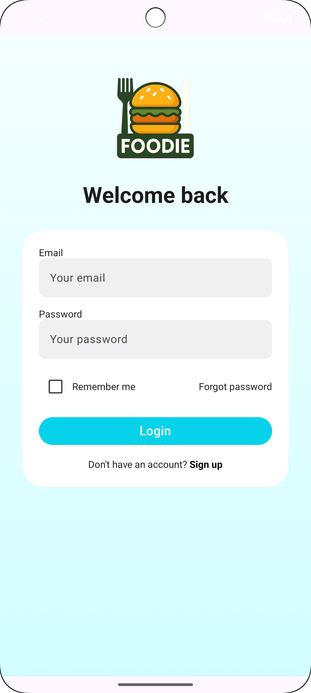<br/>
      <sub>Login screen</sub>
    </td>
    <td align="center">
      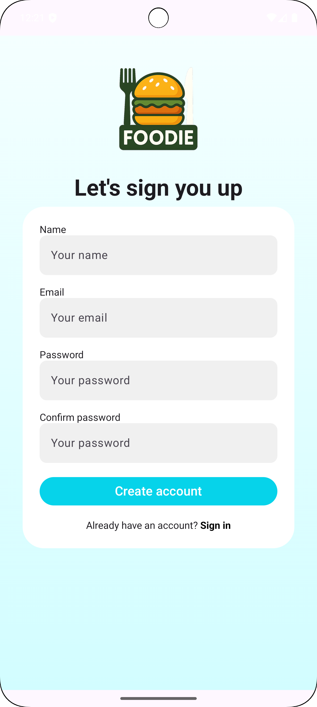<br/>
      <sub>Sign up screen</sub>
    </td>
    <td align="center">
      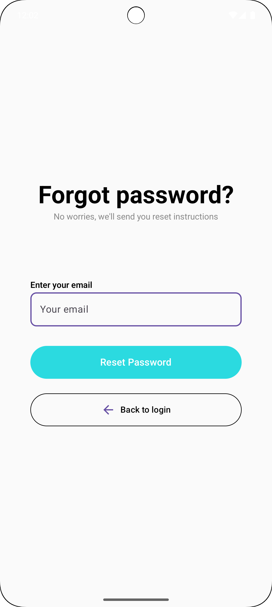<br/>
      <sub>Forgot password screen</sub>
    </td>
    <td align="center">
      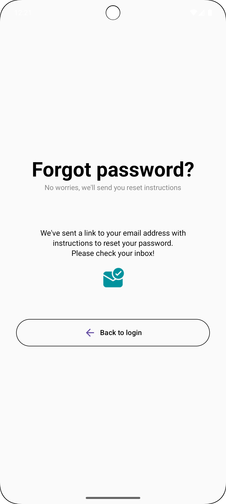<br/>
      <sub>Reset password confirmation</sub>
    </td>
  </tr>
</table>

### Browsing and Ordering
<table>
  <tr>
    <td align="center">
      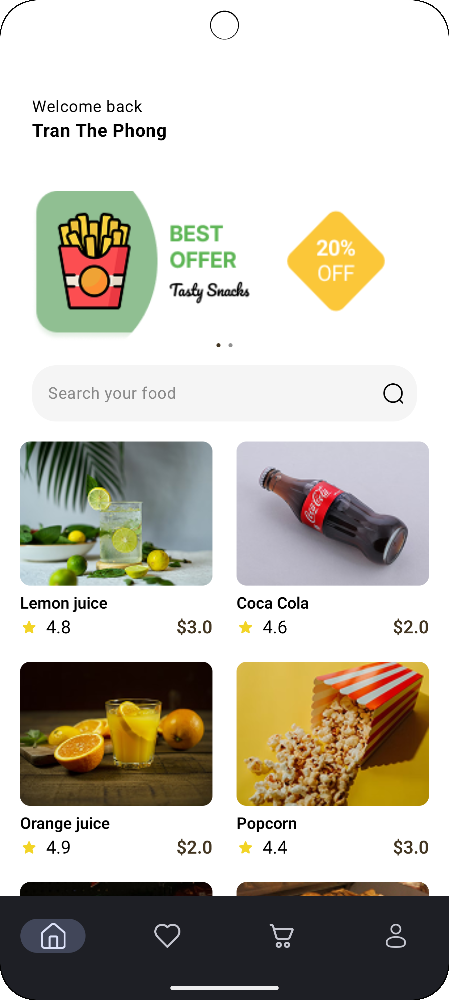<br/>
      <sub>Home / categories & highlights</sub>
    </td>
    <td align="center">
      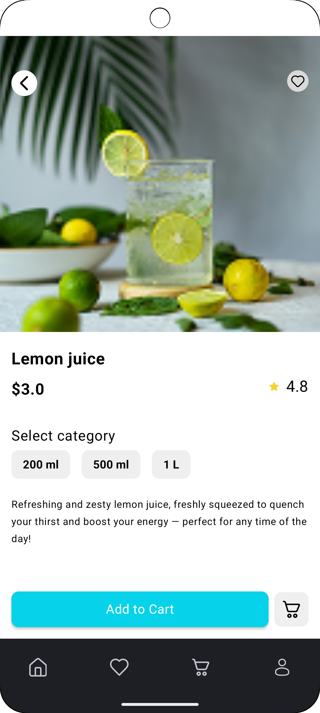<br/>
      <sub>Product detail / add to cart</sub>
    </td>
    <td align="center">
      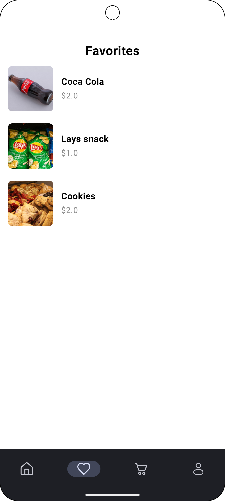<br/>
      <sub>Favorites items</sub>
    </td>
    <td align="center">
      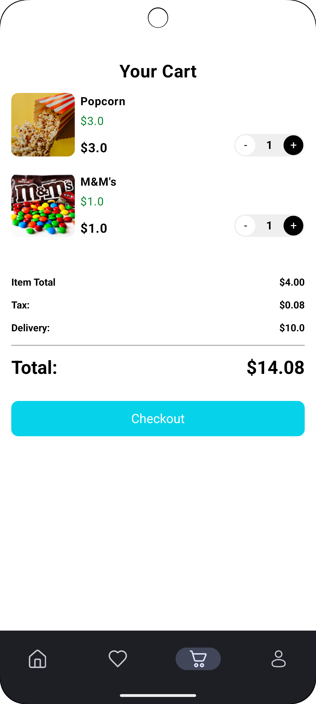<br/>
      <sub>Cart management</sub>
    </td>
  </tr>
</table>

### Settings
<table>
  <tr>
    <td align="center">
      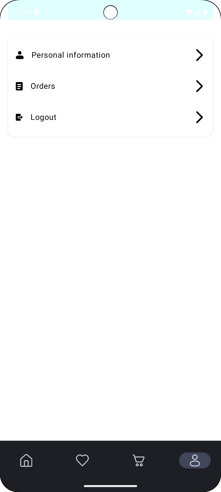<br/>
      <sub>Settings</sub>
    </td>
    <td align="center">
      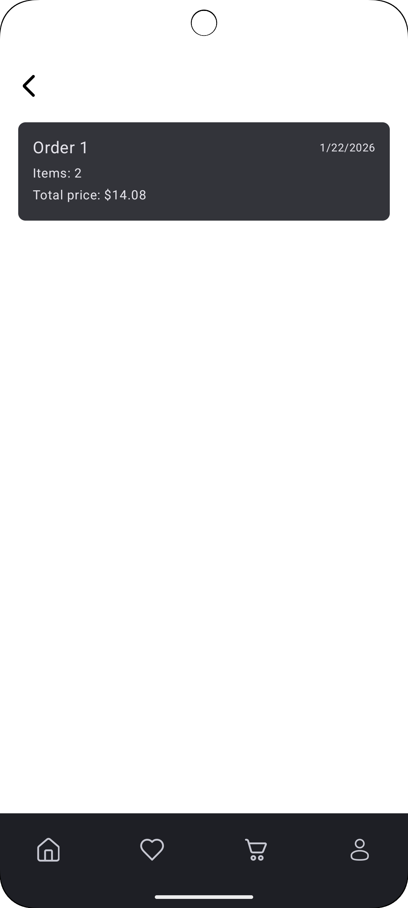<br/>
      <sub>Order history</sub>
    </td>
    <td align="center">
      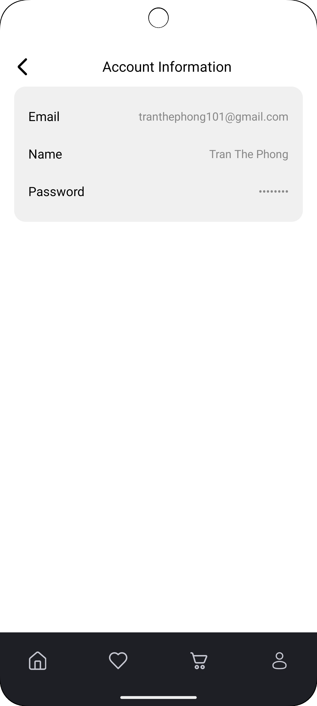<br/>
      <sub>Account information</sub>
    </td>
  </tr>
</table>

## Features

- **User Authentication**: Login and registration functionality.
- **Home Screen**: Display food categories and popular items.
- **Cart Management**: Add, remove, and modify items in the cart.
- **Favorites**: Save and view favorite items.
- **Order History**: Track previous orders.
- **Profile**: View and update user profile details.
- **Splash Screen**: A beautiful splash screen when the app launches.
- **Search**: A search bar to find food items easily.

## Architecture

The app follows the **MVVM** (Model-View-ViewModel) architecture pattern:

- **Model**: Contains data classes (`ItemsModel`, `OrderModel`, `SliderModel`) that represent food items, orders, and sliders.
- **View**: Activities such as `Home`, `Cart`, `Profile`, `Favorite`, and `Splash`, which define the UI and user interactions.
- **ViewModel**: The `MainViewModel.kt` handles the app's business logic and communicates between the UI and data layers.
- **Repository**: The `MainRepository.kt` class manages data operations, fetching data from local storage or the server.
- **Helper**: Utility classes like `ChangeNumberItemsListener.java`, `ManagementCart.java`, and `TinyDB.java` manage cart interactions and local storage.

## Technologies

- **Kotlin**: The main programming language used to build the app.
- **MVVM Architecture**: For a clean separation of concerns.
- **Android Jetpack**: Components like `LiveData`, `ViewModel`, and `Navigation` are used for UI and data management.
- **TinyDB**: A helper for managing local storage.

## Installation

To run the app locally, clone the repository and open the project in Android Studio or any proper editor.
```bash
https://github.com/ChaoZiK/FoodDeliveryApp.git
```

## License

This project is for learning/demo purposes.
